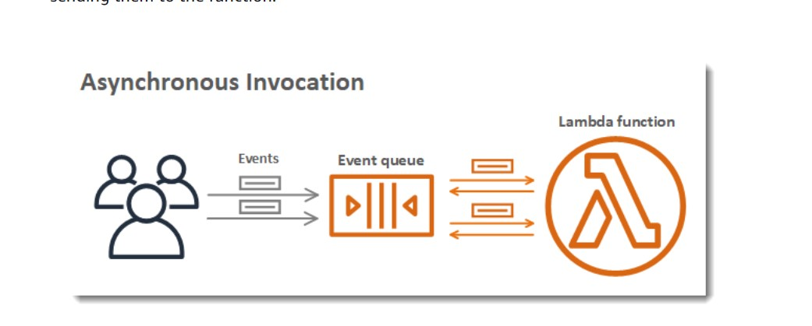
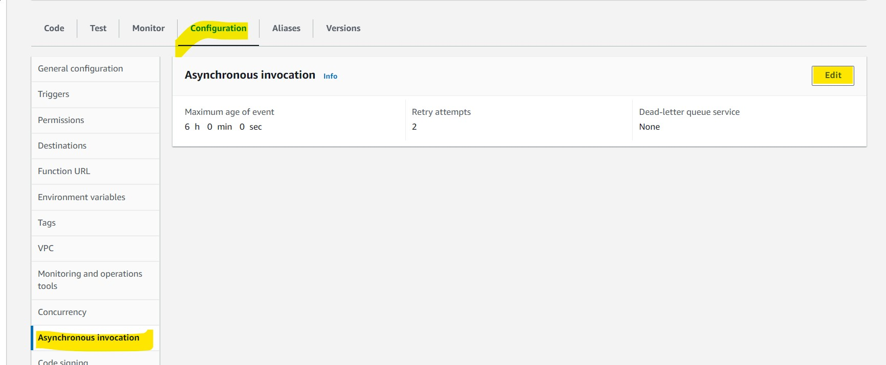
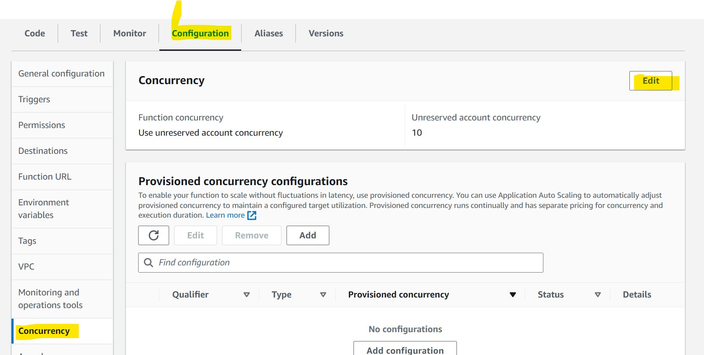
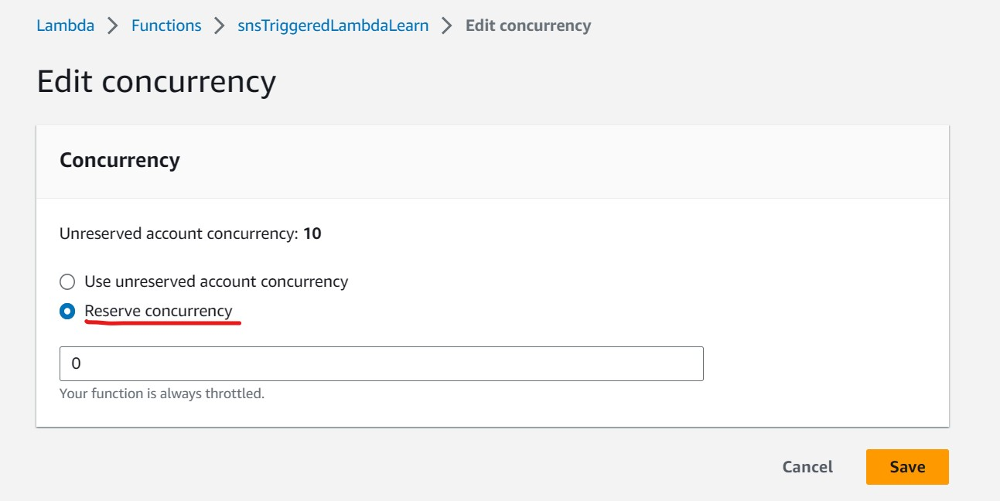

<h1>Notes</h1>

<h3>Publish Batch Messages</h3>

 We can publish upto 10 messages in a batch, otherwise we get the following error 
'The batch request contains more entries than permissible.'.
  Each message within a PublishBatch API request needs to be assigned a unique batch ID (up to 80 characters).
.

<h3>Async and Sync Invocation</h3>

 When you invoke a function synchronously, Lambda runs the function and waits for a response. When the function completes, Lambda returns the response from the function's code with additional data, 
such as the version of the function that was invoked

 For asynchronous invocation, Lambda places the event in a queue (internal to the Lambda) and returns a success 
response without additional information (ex: sns,sqs). Lambda manages the function's asynchronous event queue and attempts to retry on errors. If the function returns an error, Lambda attempts to run it two more times, with a one-minute wait between the first two attempts, and two minutes between the second and third attempts. Function errors include errors returned by the function's code and errors returned by the function's runtime, such as timeouts.

  

If the function doesn't have enough concurrency available to process all events, additional requests are throttled. For throttling errors (429) and system errors (500-series), Lambda returns the event to the queue and attempts to run the function again for up to 6 hours. The retry interval increases exponentially from 1 second after the first attempt to a maximum of 5 minutes. If the queue contains many entries, Lambda increases the retry interval and reduces the rate at which it reads events from the queue. 

Even if your function doesn't return an error, it's possible for it to receive the same event from Lambda multiple times because the queue itself is eventually consistent. If the function can't keep up with incoming events, events might also be deleted from the queue without being sent to the function. Ensure that your function code gracefully handles duplicate events, and that you have enough concurrency available to handle all invocations. 

When the queue is very long, new events might age out before Lambda has a chance to send them to your function. When an event expires or fails all processing attempts, Lambda discards it. You can configure error handling for a function to reduce the number of retries that Lambda performs, or to discard unprocessed events more quickly.

it retries 2 times and then discards the message, which is then lost. 

<h3>Setup a DLQ</h3>
We can setup a deadletter queue on the lambda function and everytime the retries from the internal queue are 
unsuccessful, we can move those messages to a SQS queue.

5. To configure the max concurrent instances of a Lambda function. Go to

6. If we publish to SNS and the subscriber doesnt exist(if we delete the lambda), then we can setup a DQL 
on the subscription itself and push those messages to a SQS queue.

Go to the subscription and click on edit

